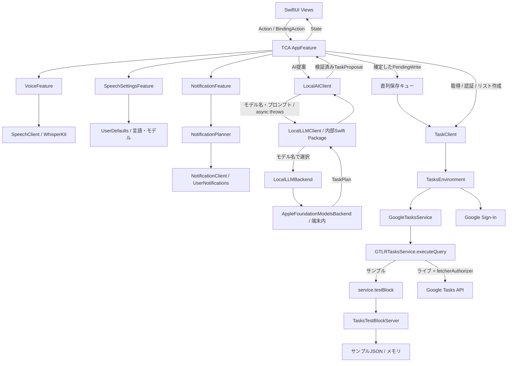
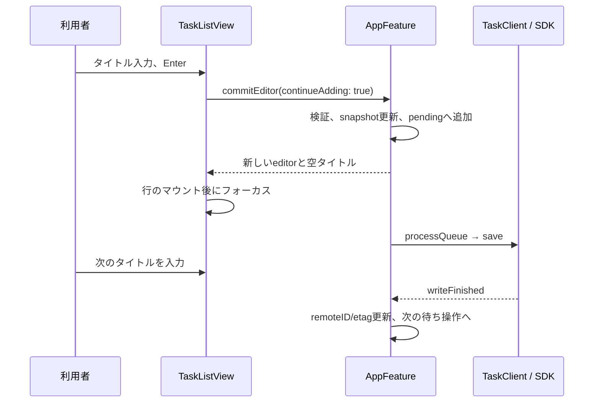

# greminder アーキテクチャ

更新日: 2026-09-20 / 対象: SOLID・SSOTレビュー後の実装（0.1.0）

## 1. 全体構成

SwiftUIは表示とユーザー操作の通知を担当し、TCAの`AppFeature`が画面状態と操作を管理する。手入力とAIからの確定操作は、共通の保存キューと`TaskClient`へ流す。Google Tasksへの呼び出しはGoogle公式SDKに集約する。

`testBlock`は独立したCLIコマンドではなく、Google SDKが提供するリクエスト差し替えフックとして使用する。サンプルでも通常のクエリ生成・`executeQuery`・完了コールバックを通る。ライブモードのサービスには`testBlock`を設定しない。

## 2. モジュールと責務

| ファイル | 責務 |
|---|---|
| `Greminder/App/GreminderApp.swift` | 起動、macOSの単一Window、iOSのWindowGroup |
| `Greminder/AppFeature.swift` | `@Reducer`、`@ObservableState`、入力・選択・保存・認証の状態遷移 |
| `Greminder/AppFeature+Persistence.swift` | 保存・削除キュー、リモートIDの伝播、共有受信箱の取消・再試行 |
| `ShareSupport/CalendarDay.swift` | アプリ・共有拡張で共用する検証済みのグレゴリオ暦日 |
| `Greminder/AppFeature+AI.swift` | リクエスト識別、提案の文脈検証、共通保存キューへの適用 |
| `Greminder/AppFeature+Scheduling.swift` | 編集中の通知設定、予定日変更、検証後の通知反映 |
| `Greminder/Models/TaskModels.swift` | タスク、日付、編集、通知変更、入力制約、一覧の所属判定、送信待ちの値型 |
| `Greminder/Services/TaskClient.swift` | TCA依存インターフェース、実環境の構築、サインインとサービス切り替え |
| `Greminder/Services/GoogleTasksService.swift` | SDKクエリ、ページング、モデル変換、非同期ブリッジ |
| `Greminder/Services/TasksTestBlockServer.swift` | SDKのクエリを受けるサンプルサーバー、JSON保存、障害注入 |
| `Greminder/Services/LocalAIClient.swift` | TCA依存、モデル名・プロンプトの指定、型付き結果の検証、エラー翻訳 |
| `Packages/LocalLLM` | モデル選択、可用性、推論SDK、テキスト・構造化生成、共通結果・エラー |
| `Greminder/Views/GreminderRootView.swift` | @StateによるルートStoreの所有、NavigationSplitView、サイドバー、シート |
| `Greminder/Views/TaskListView.swift` | 一覧、インライン編集、入力フォーカス、エラー表示 |
| `Greminder/Views/TaskRow.swift` | 表示値と操作コールバックを受け取るタスク行・共通完了ボタン |
| `Greminder/Views/TaskNotificationEditor.swift` | タスク個別通知のON/OFFと日時編集 |
| `Greminder/Views/AIComposerView.swift` | AI入力、処理状態、提案内容、適用・キャンセル |
| `Greminder/Views/SettingsView.swift` | Google接続、AI可用性、表示言語・音声・通知の設定 |
| `Greminder/Views/NewListSheet.swift` | リスト名・アイコン・背景色の選択 |
| `Greminder/Models/ListAppearance.swift` | 選択可能な外観とアカウント別の端末保存 |
| `Greminder/Localization.swift` | 翻訳参照、共有表示言語、旧保存キーの移行 |
| `Greminder/VoiceFeature.swift` | モデル準備・録音・停止・結果確認・キャンセルの状態遷移 |
| `Greminder/SpeechSettingsFeature.swift` | 言語・モデル設定と永続化の依存 |
| `Greminder/Services/SpeechClient.swift` | モデルキャッシュ、マイク、WhisperKitデコード、一時録音の削除 |
| `Greminder/NotificationFeature.swift` | 通知設定、タスク更新、差分ダイアログ、保存の直列化と最新状態への集約 |
| `Greminder/Services/NotificationClient.swift` | 純粋な通知計画、設定保存、OS通知予約 |
| `Greminder/Views/VoiceInputView.swift` | 録音と文字起こし結果の確認 |
| `Greminder/Views/NotificationConflictView.swift` | 過去の通知日と予定日との差分確認 |
| `Greminder/Views/Theme.swift` | プラットフォームの背景色、システムカラー |

`GreminderKit`はSwiftパッケージの共有ライブラリ。XcodeGenが生成するiOS / macOSアプリターゲットはこれを参照する。同じ起動コードを使うSwiftPM実行ターゲット`GreminderDesktop`も用意する。

## 3. 状態管理

`GreminderRootView`はルートのTCA Storeを`@State`で所有し、SwiftUIのView再評価で作り直さない。macOSは単一の`Window`を使う。Google接続と通知サービスがプロセス内で共有されるため、別ウインドウの独立したアカウント状態から同じサービスへ書き込む構成を避ける。iOSの起動には`WindowGroup`を使う。

ルートの`AppFeature.State`がデータのスナップショット、選択中のリスト、検索、編集中の行、保存キュー、エラー、AI提案、シート表示、iPhoneの表示カラムを保持する。Viewの`@Bindable`は`BindingAction`へ変換される。入力フォーカスはSwiftUIの`@FocusState`に置き、タスクの確定判定はReducerが行う。

音声、音声設定、通知は子ReducerへScopeする。外部処理は`taskClient`、`localAI`、`speech`、`speechSettings`、`notifications`のTCA依存へ分離する。テストでは必要なクロージャを差し替え、実SDKへの意図しないアクセスを防ぐ。UUIDは編集、AIリクエスト、音声セッションなどの識別にTCA依存を使う。AIとスケジュールの処理は同じFeatureの拡張ファイルへ分け、共通スナップショットと保存順序を維持する。

単一の正本を必要とする項目は、入力制約を`TaskInputPolicy`、リストの所属判定を`TaskSnapshot.tasks(for:today:)`、表示言語を共有AppStorage、リスト外観を`ListAppearanceStore`へ集約する。SDK呼び出しと永続化は依存クライアントの実装へ置き、Viewから直接実行しない。

AI入力欄の表示は`AppFeature.State.showsAIComposer`（初期値true）をBindingActionで切り替える。`TaskListView`が入力欄を条件付きで配置し、ツールバーは表示時に輝き、非表示時に斜線付きの輝きアイコンを表示する。`AIComposerView.onDisappear`で入力フォーカスを解除する。`aiText`と提案はルートのStateに残るため、再表示しても失われない。表示状態は永続化しない。

検索UIは`TaskSidebar`に集約し、検索欄をスクロール領域の下に配置する。`showsSearch`と`search`はTCAのBindingActionで管理する。`searchResults`が全スナップショットのタイトル・メモを検索し、通常の`matchingTasks`は検索語に依存しない。`HomeSearchResults`の選択は`openSearchResult`で既存編集を確定してから所属リスト・詳細へ遷移し、既存の保存キューを使う。

### タスク詳細の表示

`AppTheme.tint(selection, lists:)`が保存済みのリスト色を解決する。一覧がSwiftUIのtintを提供し、ツールバー・AI入力・提案の操作ボタンへ伝える。詳細は編集中タスクの所属リストから色を解決する。iOS詳細の操作ラベルにはplainボタンスタイルとprimary文字色を使い、本文への着色を防ぐ。

`FloatingAddButton`はリスト・タスク追加の共通UI。スクロール領域の右下に重ねて表示し、コンテンツ下部の余白で最終行をボタンの上までスクロールできるようにする。既存の`showsNewList`と`beginAdd`を使うため、作成や連続入力の状態管理は変えない。

`TaskDetailLayout`はOSごとに表示を分岐する。Macでは一覧と340 ptの詳細カラムをHStackで配置し、iOSでは`IOSTaskDetailSheet`をsheetで表示する。iOSのモーダルはNavigationStackとFormを使い、無効な入力がある間はスワイプによる閉じる操作を無効にする。通知設定と削除確認は詳細の上から提示し、ルート側との重複提示を避ける。起動時の通知差分ダイアログは詳細を閉じるまで待つ。`showsTaskDetails`と既存の`TaskEditor`をTCAで一元管理し、入力ドラフトはインラインと共有する。

`openDetails`は前の有効な編集を確定し、`saveDetails(taskID)`は共通のcommitと送信キューを使って編集セッションIDを維持する。古い画面からのフォーカスイベントはtaskIDで拒否する。無効なドラフトでは閉じる・選択移動・完了を拒否し、通信失敗でも楽観更新と再試行キューを保持する。空タイトルで破棄できるのは新規のインライン行だけで、既存タスクの無効な編集は保持する。完了操作は開いている詳細にも反映する。親削除時はその子の詳細も閉じる。[操作仕様](detail-behavior.md)

### 日本語・英語のローカライズ

`Greminder/Localizations/{ja,en}.lproj/Localizable.strings`をSwift Packageのリソースとして処理する。`defaultLocalization`はen。`L10n`は選択言語の`Bundle.module`内の翻訳を参照し、パラメータ付き文字列は位置指定も可能な書式で展開する。UIだけでなくサービスのエラーやアクセシビリティも同じキーを使う。

表示言語は`AppFeature.State`の`@Shared(.appStorage(L10n.preferenceKey)) displayLanguage`を正本とし、`displayLanguageChanged`が共有値を更新する。保存キーは`displayLanguage_v2`。新しいキーが未作成で、旧`displayLanguage.v1`に有効な値がある場合だけ移行する。`L10n`も同じキーの`@SharedReader`から読むため、画面・サービスエラー・日付表示で異なる言語を保持しない。テストは`defaultAppStorage`を差し替えて実際の設定から隔離できる。ルートがSwiftUIのlocale環境を更新し、各Viewが変更を受けて再評価される。再作成による入力破棄を避けるためViewのidは変更しない。日付フォーマットとAIの対応言語確認にも選択言語を使用する。認識言語・モデルは従来のSpeechSettingsFeatureで管理する。

アプリ本体の`InfoPlist.strings`はXcodeGenのiOS/macOS双方へリソースとして含める。CLIで作成するMacプレビューにも言語リソースをコピーする。`scripts/check-localizations.py`が翻訳キーの欠落・重複・空値・引数不整合をチェックし、既存の品質ゲートに含める。

参考: [AppleのSwift Packageローカライズ](https://developer.apple.com/documentation/xcode/localizing-package-resources)、[Google Tasksのリストリソース](https://developers.google.com/workspace/tasks/reference/rest/v1/tasklists)。

### 入力と保存の流れ

`TaskInputPolicy`のタイトル・メモ・AI指示の上限を入力UI、Reducer、音声、AIアダプターで共用する。`commit`がタイトルをトリムして検証した後に、タスクと通知の変更を確定する。

新規行は送信前からローカルIDを持ち、SDKのレスポンスでIDが返ってもViewのIDを変えない。`remoteID`を別に持つことで、入力中の行・親子参照・保存待ち編集が再描画や応答順序で失われることを避ける。

`processQueue`は常に先頭1件を処理する。既存の送信中または失敗状態では開始しない。成功時は後続の同じタスクへの操作と編集中の行にも`remoteID` / `etag`を伝播する。先行する親の作成完了後に、そのGoogle IDで子を作成する。削除では`descendantIDs`で子孫をまとめて除き、未送信の関連操作を取り除く。送信中の作成がある場合はその応答を受けてから削除する。兄弟位置の解決には親とリストの一致も確認する。

保存失敗は楽観更新を巻き戻さず、キューを停止してエラーと再試行操作を表示する。このキューはメモリ内にあり、永続的outboxではない。

## 4. モデルと日付

| 型 | 主な内容 |
|---|---|
| `TaskList` | ID、名称、表示用SF Symbolと色 |
| `ReminderTask` | ローカルID、Google ID、リストID、タイトル、メモ、予定日、完了、親ID、位置、etag |
| `TaskDay` | `yyyy-MM-dd`のグレゴリオ暦日。文字列・デコード時の検証、比較、API表現 |
| `TaskSnapshot` | リストとタスク。取得結果・AI文脈・一覧とバッジの共通所属判定 |
| `TaskEditor` | 編集セッションID、編集中のコピー、新規判定、挿入位置、未確定の通知変更 |
| `TaskScheduleChange` / `TaskNotificationEdit` | 日付・時刻・有効状態の編集意図と、保存前の通知ドラフト |
| `PendingWrite` | 保存／削除操作、タスク、直前の兄弟ID |
| `TaskProposal` | 追加／日付変更／完了、対象タスク、追加する子タイトル |
| `AIRequest` / `AIProposalBatch` | リクエストUUIDと開始時の文脈、提案と適用時に確認する文脈 |

`TaskDay`は共有モジュールの`CalendarDay`の別名であり、API表現とローカライズ表示だけをアプリ側のextensionで提供する。共有ドラフトも`dueDay`を正本とし、DatePicker向け`due`は計算プロパティで変換する。旧Date形式は読み込み時に移行する。

日付を時刻として同期しない。送信は`yyyy-MM-ddT00:00:00.000Z`、受信は先頭の暦日部分を検証する。`TaskDay(date:calendar:)`は指定されたタイムゾーンを保持してグレゴリオ暦で年月日を抽出し、端末の仏暦・和暦をAPIの年として送らない。Dateへの変換もグレゴリオ暦の正午を基準とする。保存データのデコードも文字列初期化と同じ検証を通すため、破損した日付が値型の不変条件を回避しない。

サイドバーの件数とタスク一覧は`TaskSnapshot.tasks(for:today:)`を共用する。完了一覧は完了状態だけで判定し、未完了の子を含めない。予定に合う親に含まれる未完了の子も同じ規則で数え、折り畳みは表示だけに適用する。

色とアイコンはクライアントの表示属性。Googleに同名のカスタマイズ情報を書き込まない。`ListAppearanceStore`がUserDefaultsの`listAppearances.v1`へアカウントキー → リストID → 外観の辞書を保存する。Google接続はユーザーID、サンプルは専用キーで分離する。SDKでリスト作成が成功した後に外観を記録し、再取得時に適用する。保存済み外観がない既存リストは、名前と順序から決めた初期表示を`resolve`で一度保存する。以後の並び替えで色が変わらない。読み込みは保存済み辞書を参照し、更新は最新の辞書へマージするため、複数のStoreインスタンスによる古いキャッシュの書き戻しを防ぐ。未知の色・シンボルは青のリストへフォールバックする。

## 5. Google SDKの呼び出し

| 処理 | 生成済みSDKクエリ |
|---|---|
| リスト一覧 | `GTLRTasksQuery_TasklistsList` |
| タスク一覧 | `GTLRTasksQuery_TasksList` |
| 新規タスク | `GTLRTasksQuery_TasksInsert` |
| 編集・完了・予定日変更 | `GTLRTasksQuery_TasksPatch` |
| タスク削除 | `GTLRTasksQuery_TasksDelete` |
| 新規リスト | `GTLRTasksQuery_TasklistsInsert` |

`GoogleTasksService`は`@MainActor`。SDKのコールバックキューをmainに設定し、`withCheckedThrowingContinuation`でasync / throwsへ変換する。アプリに独自のURLSession Tasksクライアントは置かない。

取得は`maxResults = 100`で`nextPageToken`がなくなるまで繰り返す。タスクは`showCompleted = true` / `showHidden = true`。SDKによる自動ページングを切り、サンプルと同じコードでページングを検証する。

PATCHで予定日を解除するときは、プロパティ省略ではなくJSONの`null`を送る。etagがある更新・削除には`If-Match`を設定する。サンプルも`If-Match`を検証して古いETagを拒否し、成功した更新ではETagを更新する。

新規作成の結果不明時に自動再送しないよう、SDKの自動リトライを無効にする。ユーザーによる再試行は可能だが、重複検出・冪等化は未実装。

### testBlockサーバー

`attach(to:)`が`service.testBlock`を設定し、`ticket.originalQuery`の具体型とプロパティを調べる。返すオブジェクトも`GTLRTasks_Task`等のSDK型。対応しないクエリはエラーにする。

`pageSize`でページングを強制でき、`failNextRequest`で次の1件を失敗させる。`requestedQueries`にクエリ型を記録する。JSON保存は変更後のスナップショットをatomic writeし、書き込みが成功してからサーバー内状態を更新する。PATCHは指定されたプロパティだけ変更し、省略された値は保持する。予定日の解除は明示的な`NSNull`と省略を区別し、`NSNull`をStringとして読まない。

このサーバーはアプリが使うクエリのサブセットを扱う。ETag不一致とPATCHの部分更新を扱うが、OAuth、HTTPシリアライズ、レート制限、実サービスの全制約を再現する完全なGoogleエミュレーターではない。

## 6. Google認証とモード

`TasksEnvironment`がサンプルサービスと現在のサービスを保持する。接続・復元では候補サービスから最初のスナップショットを取得できてから、サービスとアカウントを一緒に公開する。切断でも先にサンプルの読み込みを成功させてからサインアウトする。途中で取得に失敗した場合は現在のサービスとアカウントを維持する。認証の提示・復元・サインアウトを注入できるため、実Googleログインなしで失敗時の切り替えを検証する。

ルートは編集中・保存待ち・通知変更待ち・AI／音声処理中のアカウント切り替えを拒否する。読み込み中の編集やリスト作成も制限し、古いスナップショットへの操作を新しい接続に送らない。初回load時に設定と以前のサインインを確認する。Google Sign-Inの結果からTasksスコープを確認し、`fetcherAuthorizer`を新しい`GTLRTasksService`へ設定する。トークン更新・保存はGoogle Sign-Inに委ね、独自のトークンファイルを作らない。

URLコールバックはルートViewの`onOpenURL`からSDKへ渡す。認証情報は`Config/Google.xcconfig`と任意の`Config/Local.xcconfig`からInfo.plistへ展開する。詳細は[設定手順](google-setup.md)。アカウントの切り替え時にサンプルデータをアップロードしない。

## 7. ローカルAIの境界

ローカルLLMは独立した内部Swift Package `Packages/LocalLLM`に配置する。ルートの`GreminderKit`はローカルパッケージのproductに依存する。アプリからFoundationModelsをimportせず、`LocalAIClient`をTCA用の薄いアダプターとして残す。WhisperKitの音声処理は従来の`SpeechClient`に置き、このパッケージへは移さない。

公開クライアント`LocalLLMClient`はSendableな不変クラス。`generate(model:prompt:) async throws -> String`と`generateTaskPlan(model:prompt:) async throws -> TaskPlan`を提供する。アプリはモデル名とプロンプトを渡す。モデル名の辞書で内部の`LocalLLMBackend`を選び、SDK固有の初期化・推論・結果変換をパッケージで処理する。実装済みモデルは`apple.foundation-models`のみで、未知のモデルは型付きエラーにする。別モデルの追加はパッケージ内のバックエンド実装と登録で行う。

AppleバックエンドはUIの利用可否と推論開始時の準備状態を同じ判定から導き、リクエストごとに独立した`LanguageModelSession`を作る。タスク提案は非公開の`@Generable`型で生成して、Foundation Modelsに依存しないCodable / Sendableの`TaskPlan`へ変換する。アプリ用の`TaskProposal`とデータへの適用はパッケージに含めない。外部のモデルAPIやSDK Toolによる直接書き込みは使わない。

呼び出し元のTaskからキャンセルを引き継ぎ、生成前後にキャンセルを確認する。SDKが遅れて返しても結果をアプリへ渡さない。TCAのEffectはCancellationErrorを画面エラーに変換しない。並列呼び出しはセッションを共有せず、プロンプトや出力が混ざらない。可用性と失敗は共通のenumで公開し、表示言語への翻訳はアプリ側に残す。[公開APIとモデル追加手順](../Packages/LocalLLM/README.md)

モデルへ渡すのはユーザー指示、基準日・タイムゾーン、対象範囲のJSON。タイトルやメモは命令ではなくデータとして扱うよう指示する。返された操作数、文字数、日付、リストID、既存タスクID、対象の重複をSwiftで検証し、構造化された`TaskProposal`へ変換する。

AIはReducerへ提案を返すだけで、適用には画面上の操作が必要。開始時に`AIRequest`へUUIDと`AIContext(snapshot, account)`を保存する。TCAのキャンセルIDもこのUUIDを含め、`aiResult`は現在のリクエストと一致する場合だけ受理する。`isThinking`はリクエストの有無から導く。提案は`AIProposalBatch`に文脈とまとめて保持し、提案配列・例示状態はここから導く。

適用時は編集を検証して確定し、保存待ちがないことと開始時の文脈が現在のスナップショット・アカウントに一致することを確認する。変更があれば提案を破棄して再生成を促す。リスト移動・キャンセル・例示への切り替えでは実行中のEffectを中止し、遅れて届いた古い結果もUUIDで拒否する。生成結果が意味的に正しいことを型検証だけで保証するものではないため、プレビューで内容を確認する。

## 8. 音声入力

`VoiceFeature`はidle → preparing → ready → requestingPermission → recording → transcribing → reviewを管理する。モデル準備時にセッションUUIDを生成し、準備完了・録音開始・文字起こし結果を同じIDで照合する。readyやreviewでもIDを保持し、閉じる操作でそのセッションだけ解放する。TCAのキャンセルIDは`work(UUID)`と`timer(UUID)`で、別StoreのEffectを同じ固定IDで取り消さない。`AppFeature.openVoice`から準備を開始し、共通の`LoadingView`オーバーレイを表示する。録音は`AVAudioRecorder.record()`で開始し、固定の時間制限を設けない。録音中は50msごとに`SpeechClient.recordingStatus`で実際の録音時間と正規化した音量を取得する。波形の履歴は直近200サンプルに制限し、`VoiceWaveformView`のCanvasで描画する。レコーダーが停止した場合は残っている音声の文字起こしへ進む。バックグラウンド移行はルートからキャンセルする。

`SpeechSettingsFeature`はCodableの`SpeechPreferences`をUserDefaultsの`greminder.speech.v1`へ保存する。モデルと言語は型付きenum。Large v3 Turboは公式配布の`openai_whisper-large-v3-v20240930_626MB`を使用する。モデル変更時は一時的な音声セッションで`SpeechClient.prepare`を呼び、取得・読み込み中は共通の`LoadingView`を設定画面に重ねて表示する。準備後はセッションを解放してパイプラインを保持し、成功時のみ選択設定を保存する。失敗時は元の選択と再試行可能なエラーを残す。次の音声シートを開く際に値をコピーし、そのセッション内で固定する。WhisperKitの`DecodingOptions`へ言語コードを渡し、自動判定ではlanguage=nil / detectLanguage=trueにする。Whisperの既定値では自動判定が有効にならないため、明示指定する。

`WhisperSpeechEngine`はMainActorでマイクとパイプラインを所有する。`prepare(preferences, sessionID:)`で設定をセッションに固定し、別セッションによるモデル・言語の上書きを拒否する。キャンセルは具体的な所有IDを必要とし、準備していない画面や無関係なIDからの操作では別の処理を止めない。モデル名とパイプラインは`PreparedModel`へまとめて保持する。

モデルを変更する前に、中止した文字起こし・モデル読み込みのTaskが終了するまで待つ。SDKの中止が遅れても、次の重いCore ML読み込みと重ねない。キャンセルは内部Taskへ伝播し、完了後も所有IDを検証して古い処理からパイプラインを公開しない。モデル別のキャッシュパスは準備成功後にatomic writeする。Hugging Faceからのモデル・トークナイザー取得以外に音声サービスを呼ばない。

`SpeechStorage`は実際の空き容量（`volumeAvailableCapacity`、解放可能領域を含めない）を確認する。準備時はダウンロード前とCore ML読み込み前、実行時は録音・文字起こしの前に検証し、準備済みパイプラインの再利用でも省略しない。Large v3 Turboの下限はSimulatorで8 GB、それ以外で2 GB。WhisperKit標準のSimulator CPU実行設定を維持する。容量不足でCore ML / BNNSがネイティブクラッシュする経路はSwiftのcatchで回復できないため、呼び出す前に`AppFailure`へ変換する。

容量取得とモデル読み込みのクロージャをエンジンの初期化時に注入できる。低容量ではSDKへ到達しないこと、ロードを停止させたテスト用依存でもセッション所有権とキャンセルが維持されることを検証する。TCAはidleとエラー表示へ戻し、空きを確保した後に同じ操作から再試行できる。下限は保守的な予防値であり、検証後に他プロセスがディスクを消費する競合まで防ぐものではない。調査条件と証跡は[障害調査](diagnostics/large-v3-turbo-simulator.md)を参照。

録音は16kHz / mono / PCMの一時CAFへ保存する。停止後は16,000フレーム単位のバッファで最小録音時間・無音を検証し、WhisperKitのincremental読み込みで文字起こしする。長時間音声でもファイル全体を配列へ展開しない。無音チェックとnoSpeechProbで無音の誤生成を抑制する。結果はユーザーの編集後にルートへdelegateし、編集中の行IDが一致した場合のみタイトルへ追記する。AIの音声入力もaiTextへ追記するだけで自動実行しない。

## 9. 通知と差分確認

`TaskScheduleSection`、macOS詳細、インラインの予定日・通知ピッカーはすべて`editorSchedule(taskID, TaskScheduleChange)`を送る。日付・時刻・有効状態の変換は`AppFeature+Scheduling`に集約し、Viewはフォーカスとピッカーの展開を保持する。表示には`editorNotificationDate`と`editorNotificationEnabled`を使い、通知ドラフト、確定済みの反映待ち、保存済み記録の順に解決する。

編集途中の変更は`TaskEditor.notificationEdit`へ保持し、`TaskInputPolicy`を通過するまで永続化やOS予約へ送らない。詳細では有効な変更を即時確定し、インラインでは行の確定まで保持する。無効なタイトルやメモがある場合もドラフトは残り、通知だけが先に保存されることを防ぐ。キャンセルしたインライン行の通知変更は破棄する。

検証後の通知変更はルートの`pendingNotificationEdits`へ移し、`notificationEffects`が最新スナップショットの通知計画更新に続いて時刻・有効状態を順番に送る。通知設定がまだ未読込なら変更を保持し、読込完了後に反映する。明示的なローカル予定日変更は通知の時・分を保持して日付を移すため、元の通知が期限超過でもiOS・macOS・インラインで同じ動作になる。リモート再取得で検出した期限超過の不一致は後述の確認対象として保持する。

`NotificationRecord.isEnabled`はタスク単位の通知許可。旧データにキーがない場合はtrueとしてデコードし、既存の予約動作を維持する。オフの記録は保存し続け、予約と期限超過の差分確認から除外する。グローバル設定・他タスク・予定日は変更しない。完了済みタスクでも時刻・有効状態の明示編集と保存済み記録を保持し、未完了へ戻した際に復元する。完了中は予約と期限超過の差分確認から除外し、予定日の解除またはタスク削除時に記録を除く。

`NotificationPlanner`は副作用を持たず、snapshotと現在時刻と設定から更新後の記録・差分・予約一覧を生成する。各記録は実際の端末通知Dateと、予定日の同期基準になるTaskDayを持つ。キーはアカウント、リスト、Google ID（未取得時はローカルID）のSHA-256で分離する。新規タスクへGoogle IDが付与されたときは、ローカルIDの記録を新しいキーへ移して独自の時刻と有効状態を保持する。

期限を過ぎた端末通知日とTasksの予定日が異なる場合、日付を上書きせず差分として返す。Yesは端末の時・分を保持して予定日を置換、Noは記録を変更せず起動中の無視集合へ追加する。Googleが通知時刻を公開していないため、Googleの通知設定同士を比較・同期する経路はない。

`NotificationFeature`はタスクの取得・楽観更新後に計画を再計算する。`NotificationClient`の実装はUserDefaultsの`greminder.notifications.v1`に設定を保存し、直近60件を`UNUserNotificationCenter`へ予約する。安定した通知IDで置換し、不要になったこのアプリ所有の保留通知を削除する。Reducerは`isSynchronizing`で保存を一件ずつ開始し、その間の更新を`needsSynchronization`で最新状態に集約する。終了後に必要なら最新設定で再実行し、古い完了結果を新しい成功・エラー表示として採用しない。OSへの非同期更新もサービス内のTaskチェーンで直列化する。リビジョンは結果の照合に使い、永続化順序の保証をリビジョン番号だけに依存させない。許可ダイアログは利用者が通知を有効にした時だけ要求する。

## 10. ビルド、テスト、検証

直接依存を`Package.swift`でGoogle REST SDK 5.4.0、Google Sign-In 9.0.0、TCA 1.23.1、WhisperKit 1.1.0へ固定し、推移依存を`Package.resolved`で記録する。TCAはインストール済みのSwift 6.2.4とビルドできる版を採用。ルートパッケージのSwift言語モードは5、内部`LocalLLM`パッケージは6。

- `swift test`: Reducer、保存キュー、SDK testBlock、認証失敗、通知の順序、日付、共有設定、音声セッションの回帰テスト。実WhisperKit音声テストは環境変数で有効化し、通常CIではモデル取得やマイクを使わない。
- `swift test --package-path Packages/LocalLLM`: モデルルーティング、可用性、型付き結果、キャンセル、並列呼び出しを検証する。実Foundation Modelsによる推論は別途環境変数で有効化する。
- `xcodegen generate`: `project.yml`からiOS / macOSターゲットを生成。
- iOS: XcodeBuildMCPでiPhone 17 Pro Max / iOS 26.2 Simulatorにビルド・起動。`Greminder-SpeechTests`はiOSアプリにホストされるため、ネイティブMacとは別のCore ML実行経路を検証できる。実モデルのテストは環境変数で有効化する。
- Mac: SwiftPM実行ターゲットをビルドし、`scripts/package-macos.sh`で開発用.appを作成して実行。

開発用.appはローカル`.build`も必要で、配布はXcodeターゲットで署名・アーカイブ・公証の確認が必要。

品質ゲート、実行結果、実モデルを用いた検証の条件は[QUALITY.md](QUALITY.md)を参照する。操作仕様と実画面の確認範囲は[SPEC.md](SPEC.md)と[design-qa.md](../design-qa.md)に記録する。

## 11. 次の拡張時に必要な設計

ライブキャッシュと永続outboxを追加する場合は、ローカルID・Google ID・操作順序・リビジョンを保存し、作成結果不明時の再読込と重複解決を設計する。複数操作の部分成功、ETag競合、親子の完了状態、アプリ終了中の同期を明示的に扱う必要がある。

音声・設定・通知は子Reducerへ分割済み。一覧、編集、AI、接続は共通の保存順序をルートで扱う。複数アカウントを同時表示するウインドウ構成へ拡張する場合は、現状の単一Windowを外す前に、Google接続とOS通知の所有権・状態共有をアカウント単位で設計する。品質チェックの固定版ツール、CIの必須ジョブと運用手順は[QUALITY.md](QUALITY.md)を参照する。

## 2026-09-20の整合性修正

`TasksEnvironment`の認証・読込・API切替は操作IDを持ち、await後に最新操作とキャンセル状態を確認してから接続先を公開する。MainActorの再入によって古い復元結果がログアウトを取り消すことを防ぐ。

通知の`tasksUpdated`はスナップショットと通知編集を一括で受け取り、設定反映と同期開始判断を同じReducer処理で行う。親の未適用編集は子への適用後に消し、共有受信箱の受領記録は最新の同期完了後に消す。タスクを未取得のときは設定だけを保存し、既存の予約は維持する。通知OFFは予約を解除する。

共有タスクの削除操作では、画面から除く前に受信箱へ削除意思を永続化する。未送信の記録だけを除去し、送信中・保存済みの記録は保持する。通信失敗はサーバー未保存の証明にならないため、ID不明の記録を再挿入せず専用の確認表示を出す。利用者がGoogle Tasks側の確認・削除を済ませたと明示した場合だけ記録を除去する。IDが判明していれば再起動後もそのIDの削除を再開し、画面と通知から子孫も除く。確認と同時に届いた保存成功は原子的な再検証で保護する。受信箱のv1は読み込み可能とし、次回保存でv2へ移行して旧版による削除意思の消失を防ぐ。リモート削除の再試行はSDKのHTTP 404だけを完了として扱い、権限・競合などの失敗は維持する。

共有拡張向けの`shareContext`はルートStateから導出し、選択・リスト作成・言語・通知設定の変更時に公開する。通常入力のキューの永続化は未対応である。今回の指摘と検証範囲は[CODE_REVIEW.md](CODE_REVIEW.md)を参照。
