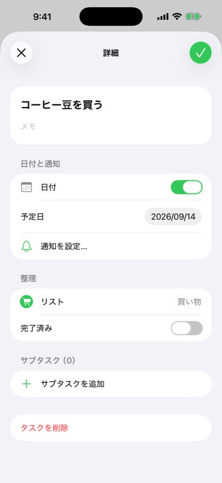

# タスク詳細の操作

更新日: 2026-09-14

## 純正リマインダーの観察

macOSのリマインダーで、選択されている「メルカリ出品」の情報ボタンを実際に操作した。行の右側の情報ボタンから詳細が開き、タイトル、メモ、URL、日付と時刻、整理、場所と人の順に表示される。日付はオン、時刻はオフで、現在の予定日が表示されていた。閉じると、元のリスト・選択行・サブタスクの展開状態が保持された。

メモの一時入力と閉じる操作も試したが、この操作環境のAX入力では再表示後の保存を確認できなかったため、純正アプリの保存タイミングを確認済みとはしていない。一時入力は空へ戻し、予定日・完了状態・既存タスクは変更していない。

利用者の指定に従い、Macは一覧右側のパネル、iOSは添付された画面を参考にしたモーダルとして実装した。

## 本アプリの動作

- Mac: 一覧右側のⓘ／コンテキストメニュー「詳細」で幅340 ptの詳細パネルを開く。選択した行を背景色で示す。開いている間の最小ウインドウ幅は1080 pt。
- iOS: 画面幅に関係なくモーダルで表示する。左上に×、右上に所属リスト色の✓を配置し、タイトルとメモ、日付と通知、整理をFormのセクションにまとめる。×と✓はどちらも有効な変更を保存して閉じる。下スワイプでも保存し、空タイトルや文字数超過の場合はスワイプで閉じられない。
- Macで詳細が開いている間に一覧の別タスクを選ぶと、現在の有効な編集を保存して対象を切り替える。
- タイトル、複数行メモ、予定日のオン／オフと日付、完了状態を編集できる。所属リストは読み取り表示。
- 通知が有効で予定日がある場合、端末の通知日時を編集できる。未設定なら設定画面へ進める。Google通知時刻との同期は行わない。
- 親タスクからサブタスクの詳細・完了操作・追加へ進める。子タスクから親の詳細へ戻れる。
- テキスト欄のフォーカス移動、タイトルのsubmit、パネルの「完了」／閉じる、タスク切り替えで保存する。日付や完了状態の変更はその操作で保存する。
- 詳細のEscは有効な編集を保存して閉じる。従来の一覧内編集のEscは取り消しのまま。
- 空タイトル・文字数超過では詳細を閉じず入力を保持し、上部に理由を表示する。通信失敗でも編集と送信待ちの変更を保持し、再試行できる。
- 削除には既存の確認ダイアログを使い、削除された対象やその子の詳細は閉じる。

URL、場所、タグ、優先順位、繰り返し、Google通知時刻は今回追加していない。Google Tasksとの保存は既存の公式SDKの書き込みキューを使い、サンプル時も同じSDKのtestBlockを通す。

## 検証

通知UIの追加確認: iPhone 17 Pro Max / iOS 26.2で日付カレンダー・時刻ホイールの展開、時刻オフ後に予定日が残ること、オンで元の09:00に戻ること、入力キーボードを行の操作で閉じることを確認した。通知の説明はカード外、時間帯は読み取り表示とした。日英253キーのチェック、formatter・linter、iOSビルド、標準テスト40件が成功（実Whisperテスト1件スキップ）。

- [時刻ホイール](diagnostics/task-schedule-time.jpg)
- [日付カレンダー](diagnostics/task-schedule-date.jpg)

2026-09-14の追加確認: 買い物リストの緑色が一覧見出し・操作アイコン・タスク追加FABへ反映され、詳細モーダルの通常文字は黒系、閉じる×は黒、操作アイコンは緑になることをSimulatorで確認した。リスト追加FABから作成シート、タスク追加FABから入力欄・キーボードが開くことも確認した。今回の変更はiOS Simulatorビルド、macOS向けSwift Packageビルド、formatter・linterを通過している。

- [リスト追加FAB](diagnostics/list-add-fab.jpg)
- [リスト色とタスク追加FAB](diagnostics/task-list-accent-fab.jpg)
- [キーボード表示中](diagnostics/task-add-fab-keyboard.jpg)

Macのサンプルプレビューで日本語タイトルと2行のメモを変更し、別タスクへの切り替え後に元の詳細を開き直して両方の保存を確認した。右側パネルと一覧の同時表示も画面で確認した。既に開いていた旧プレビューには編集中の入力があったため、別の検証用バンドル`Build/GreminderDetails.app`で確認した。

iPhone 17 Pro Max / iOS 26.2 Simulatorでは、情報ボタンからモーダルが開くこと、通知設定を重ねて開いて詳細へ戻れること、メモをIMEで確定して✓で閉じた後、一覧と再表示した詳細に保存内容が反映されることを確認した。削除確認の表示も確認した。iPad実画面、スワイプ終了、全Dynamic Typeサイズは未検証。

標準テスト40件成功、実WhisperKitの任意テスト1件スキップ。詳細について追加した5件は、SDKへの保存と日付解除、インライン入力の引き継ぎ、選択切り替えと古いフォーカスイベント、無効な入力の保持、完了・削除、通信失敗・再試行を検証する。MacプレビューとiOS Simulatorのビルド、formatter / linterも確認する。

最終ビルドでのiPhone詳細画面:

