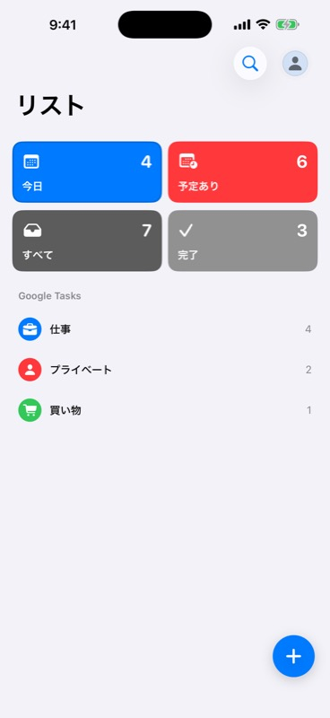
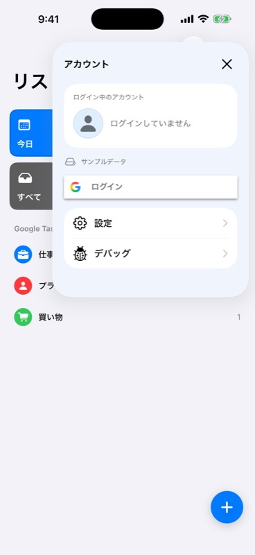

# アカウントメニュー（2026-09-17）

## 現在の表示方式

アバター押下で標準のモーダルシートを表示する。デバッグ画面と同じNavigationStack、ナビゲーションタイトル、右上の「閉じる」を備えた通常のシート。高さを半分にする指定はなく、macOSの最小サイズもデバッグ画面と同じ480×420。以前のポップアップ／オーバーレイと位置計算は削除した。以下のスクリーンショットと初回検証はモーダル化前の記録。

## 実装

- リスト一覧にだけ円形アバターを表示。検索ボタンとは背景を共有せず、アバターを右端へ配置。ログイン画面とリスト詳細のツールバーには表示しない。
- Googleプロフィールの画像URL・名前・メールを認証サービスからReducerへ渡す。画像未設定／読込失敗時はイニシャル、未ログイン時は人物アイコンを表示。
- ポップアップ内に現在の1アカウントの一覧を表示。Google SDKのログインボタンは未ログイン時のみ表示し、ログイン済みのメニューは「設定」→「ログアウト」→「デバッグ」（Debug限定）の順に同じカードへ配置。複数アカウントの同時保持は行わない。
- 設定とデバッグはポップアップからシートとして開く。通知タップではポップアップを閉じて既存の通知遷移を再開する。
- モック中の明示的なGoogleログイン／ログアウトは、タスクAPIの通信先を変更しない。通常のモック読込ではOAuthを実行しない。
- 表示用プロフィールはUserDefaultsへキャッシュし、SDKに保存済み認証がある場合のみ復元する。トークンはキャッシュせずSDKが管理する。ログアウト時はプロフィールキャッシュも削除。

プロフィール取得は[GoogleのGIDProfileData](https://developers.google.com/identity/sign-in/ios/reference/Classes/GIDProfileData)、ログインボタンは[Googleのブランドガイド](https://developers.google.com/identity/branding-guidelines)に従いSDKのコンポーネントを使用。

## Simulator操作確認

iPhone 17 Pro Max / iOS 26.2 / Debug、`--design-preview`で実施。

1. リスト一覧の検索とアバターが独立し、アバターが右端にあることを確認。
2. アバターからポップアップを開き、未ログイン表示・ログイン・設定・デバッグを確認。
3. 設定画面を開き、「完了」でポップアップへ戻ることを確認。
4. デバッグ画面とPush通知画面を開き、サンプルホームをオフ。ログイン画面ではアバターがないことを確認。
5. サンプルホームへ戻り、リスト詳細のツールバーにアバターがないことを確認。
6. ポップアップのログインからGoogle認証のシステム確認ダイアログを表示。「キャンセル」でポップアップへ戻り、再操作可能であることを確認。

実Googleアカウントでの認証完了、実プロフィール画像の表示、実アカウントのログアウトは今回の打鍵テストでは実施していない。認証成功・プロフィール反映・ログアウトは注入した認証処理とSDKのtestBlockを利用する自動テストで検証した。

## 自動検証

- `AccountMenuTests`: Swift Testing 7テスト（9ケース）成功。プロフィールの永続化・削除、モック中の認証操作、APIモード往復、一覧への反映、キャンセル／失敗、編集・保存中の拒否、通知によるポップアップ終了を検証。
- 全体: XCTest 94件（93成功・任意の実音声テスト1件スキップ）、Swift Testing 27テスト成功。
- 最終UI変更後もmacOS側のSwiftPMコンパイルとAccountMenuTestsを再実行して成功。
- iOS Simulatorのビルド・起動成功。翻訳319キー、SwiftFormat、SwiftLint、`git diff --check`成功。

## 追加調整：ログイン済みメニューと開閉時の表示

- ログイン済みではGoogleログインボタンを表示せず、「設定」「ログアウト」「デバッグ」の順に同じカードへ配置。
- UIKitの標準ポップアップが表示元のボタンに付ける選択表示を避けるため、アバターの位置を基準にしたSwiftUIのオーバーレイへ変更。写真は元の色で描画し、押下時の色変更も適用しない。
- メニュー外のタップ、閉じるボタン、アクセシビリティのEscapeで閉じる。表示中は背景のリストをアクセシビリティ対象から除外。
- ログイン済みのSimulatorでプロフィール画像、ログインボタンの非表示、メニュー順序を確認。開閉前後を録画して、従来のグレーの選択表示が出ないことを確認した。実アカウントのログアウト操作は実施していない。

## モーダル化の検証

- iPhone 17 Pro Maxでアバターからデバッグ画面と同じ通常のモーダルシートが開くことを確認。
- ログイン済みのプロフィール、ログインボタンの非表示、「設定 → ログアウト → デバッグ」の順序を確認。
- モーダルから設定／デバッグを開いて戻る操作と、閉じるボタンによる終了を確認。
- 表示元のアバターは引き続き元画像と専用のボタンスタイルを使用。標準モーダルの背景スクリーン全体の暗転は通常の表示動作。
- iOSのビルド・起動、macOS側のコンパイル、AccountMenuTests 7テスト（9ケース）、SwiftFormat、SwiftLint、翻訳チェックが成功。
